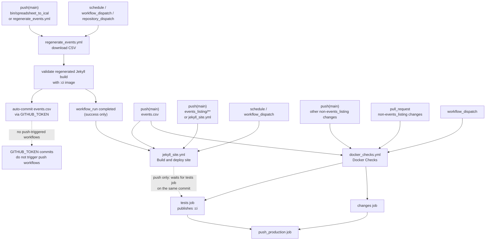

# GitHub Actions Workflow Map

This document tracks the trigger and dependency flow between the repository's GitHub Actions workflows.

Update this chart whenever a workflow trigger, cross-workflow dependency, concurrency rule, or auto-commit path changes.

Solid arrows mean "can trigger / leads to a new workflow or job path". Dotted arrows mean "waits for / depends on" and do not trigger a new workflow.

